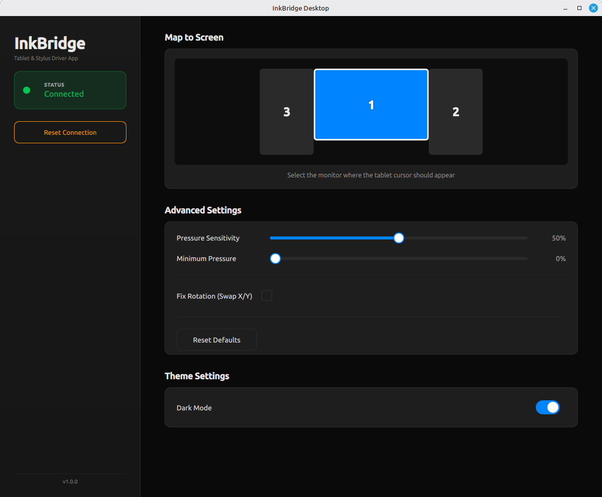
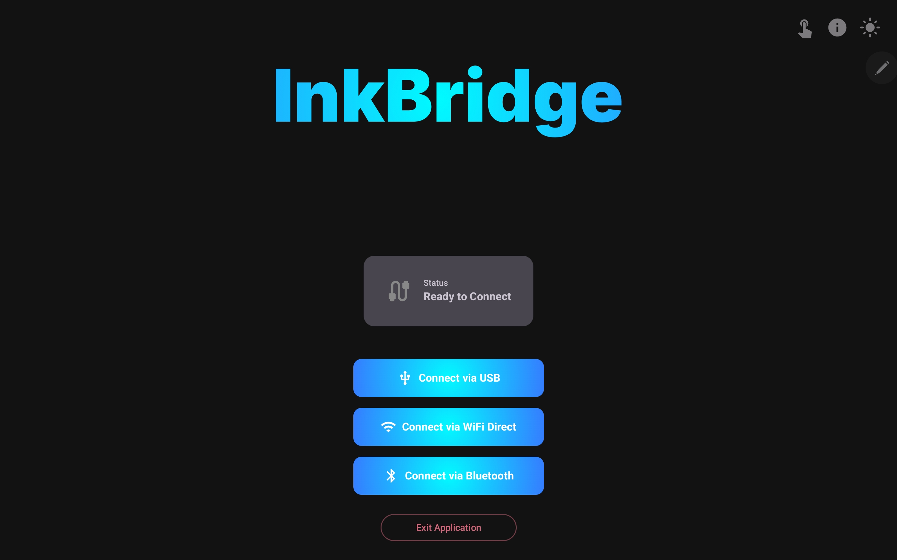

# InkBridge

**The high-performance bridge between your Android device and your Linux desktop.**

*(Because Tux deserves a super display, too. If you just switched from Windows and are desperately Googling for a "SuperDisplay alternative for Linux"—welcome home.)*

InkBridge transforms any Android device into a high-precision, system-wide input surface for Linux. Whether you are using a professional S-Pen on a Galaxy Tab, a basic capacitive stylus, or your fingertips, InkBridge maps your raw touch data directly to a virtual Linux digitizer at the kernel level. 

Because it acts as a native hardware input device, it works flawlessly with **any** software on your computer—from creative powerhouses like **Krita, Blender, GIMP, and Inkscape**, to simple whiteboarding tools, PDF annotators, and even general desktop navigation.

### 🌐 Wired & Wireless Freedom
Engineered for near-zero latency and professional-grade control, InkBridge offers three dedicated connection protocols to fit your workflow:
* **USB (AOA):** The gold standard. Bypasses standard network layers for rock-solid, absolute zero-latency wired performance.
* **Wi-Fi Direct:** High-speed, tether-free creativity. Creates a secure, peer-to-peer tunnel that automatically bypasses complex Linux firewall and router configurations.
* **Bluetooth:** A convenient, completely wireless backup option for quick sketching and casual navigation on the go.

#### Desktop UI


#### Android Tablet UI


## ✨ Key Features

* **Universal Input:** Supports S-Pen (Pressure/Tilt), capacitive styluses, and multi-touch finger input.
* **Native Canvas Gestures:** Seamlessly pan, zoom, and navigate your Linux workspace using true two-finger multi-touch (powered by Linux Protocol B).
* **USB Wired Connection:** Uses the **Android Open Accessory (AOA)** protocol for near-zero latency input.
* **Professional-Grade Input Support:**
    * **Logarithmic Pressure Curve:** Custom-tuned math for natural, responsive strokes (4096 levels).
    * **True 3D Tilt:** Projects Android sensor data to standard Linux EV_ABS tilt axes (-90° to +90°).
    * **Reliable Eraser:** "Clean Handover" protocol ensures 100% reliable tool switching between Pen and Eraser during hover or active strokes.
    * **Finger/Stylus-only Input Options:** Choose between finger or stylus-only input to ensure touching the screen with your hand won't cause unwanted inputs.
* **Linux Native Virtual Driver:** Creates a system-level `uinput` device ("pen-emu") compatible with X11 and Wayland (libinput). Use your stylus as a mouse.
* **Modern Desktop UI (Qt/QML):**
    * **Multi-Monitor Mapping:** Select exactly which screen the tablet maps to.
    * **Customizable Physics:** Adjust Pressure Sensitivity and Minimum Threshold (Deadzone).
    * **Rotation Correction:** Swap X/Y axes for landscape/portrait mismatches.
    * **Theming:** Built-in Dark and Light modes for both the desktop and Android apps.
* **Zero Bloat:** Minimalistic UI and software implementation

## 🛠️ Architecture

InkBridge is a complete modernization of the Linux-Android drawing pipeline:

1.  **Android App (Sender):** Written in **Kotlin**. Captures raw `MotionEvent` data, converts Tilt/Orientation radians to degrees, and streams packed binary structs via USB.
2.  **Linux Desktop Client (Receiver):** Written in **C++20** with **Qt/QML**. Claims the USB device, decodes the stream, and injects events into the Linux kernel via `uinput`.

### Why Wi-Fi Direct instead of standard Wi-Fi?
Connecting Android to Linux over a standard home network is notoriously unreliable. Different Linux distributions (Ubuntu vs. Fedora vs. Arch) handle firewalls (ufw, firewalld, iptables) and hotspot configurations differently. To prevent users from having to debug their local router and firewall settings, InkBridge uses Wi-Fi Direct. Android creates the network and acts as the TCP Server, while the Linux client connects *outbound*, naturally bypassing strict Linux inbound firewalls.

## 🚀 Installation & Build

### **Option 1: The Quick Way (Recommended)**
If you downloaded a release, simply run the included setup script to configure your system permissions and install the desktop shortcut:

```bash
chmod +x INSTALL.sh
sudo ./INSTALL.sh
```
*Note: You will need to log out and log back in once for the permission changes to take effect.*

### **Option 2: Building from Source**

#### Prerequisites
* **Qt 5.12+** (Core, Gui, Qml, Quick, Concurrent)
* **libusb-1.0** (Development headers)
* **C++20** compliant compiler (GCC/Clang)

#### Building the Linux Client
```bash
# Clone the repository
git clone [https://github.com/yourusername/InkBridge.git](https://github.com/yourusername/InkBridge.git)
cd InkBridge

# Install dependencies (Ubuntu/Debian example)
sudo apt install build-essential qt5-default libusb-1.0-0-dev

# Build with qmake
mkdir build && cd build
qmake ../InkBridge.pro
make -j$(nproc)
```

#### Setting up Permissions (`uinput`)
To allow InkBridge to create a virtual tablet device without running as root (sudo), you must configure `udev` rules.

1.  Create the rule file:
    ```bash
    sudo nano /etc/udev/rules.d/99-inkbridge.rules
    ```
2.  Paste the following content:
    ```bash
    # Allow access to uinput for virtual device creation
    KERNEL=="uinput", MODE="0660", GROUP="input"

    # Optional: Allow access to Android USB devices (Samsung/Google/etc)
    SUBSYSTEM=="usb", ATTR{idVendor}=="18d1", MODE="0666", GROUP="plugdev"
    SUBSYSTEM=="usb", ATTR{idVendor}=="04e8", MODE="0666", GROUP="plugdev"
    ```
3.  Apply changes:
    ```bash
    sudo udevadm control --reload-rules
    sudo udevadm trigger
    sudo usermod -aG input $USER
    ```
    *(Note: You may need to logout and login for group changes to take effect).*

## 🎮 Usage

1.  **Install the Android App** on your tablet/phone.
2.  **Install the desktop App** on your Linux desktop.
3.  Choose your connection method:

### Via USB (Recommended for 0ms Latency):
* Connect your device via USB
* Accept the *"Open with InkBridge"* prompt on your Android device (confirmation window will appear when plugging in the USB cable)
* Start drawing

### Via Wi-Fi Direct (Recommended Wireless):
* Press Connect via *Wi-Fi Direct* on the desktop app
* Tap Connect via *Wi-Fi Direct* on the Android app (a pop-up with instructions will appear)
* Connect your PC to the DIRECT-IB-INKBRIDGE Wi-Fi Network using the provided password
* Tap *"Desktop is Connected"* on the Android app (inside the pop-up) to initiate the stream
* *Note: Your PC will disconnect from your current Wi-Fi connection. It is highly recommended to use an Ethernet connection for your PC if you need internet access while drawing.*

### Via Bluetooth (Backup Option):
* Pair your tablet and PC in your system Bluetooth settings
* Tap *"Connect via Bluetooth"* in the Android app and select your PC in the discovered devices list.


### Advanced Controls
* **Pressure Sensitivity:** Adjusts the logarithmic curve. Higher values make it easier to reach 100% pressure.
* **Minimum Pressure:** Sets a deadzone floor to ignore accidental light touches (ghosting).
* **Reset Connection:** If the device gets stuck or the USB handle is busy, click the "Reset Connection" button in the sidebar to force a USB bus reset and driver re-attachment.

## 🔧 Troubleshooting

**"Error claiming interface: LIBUSB_ERROR_BUSY"**
This happens if the Linux kernel (`cdc_acm` or `usbfs`) grabs the Android device before InkBridge does.
* *Fix:* InkBridge includes an auto-detach feature. If this persists, click the **Reset Connection** button in the sidebar.

**Stylus moves but doesn't click/draw**
* *Fix:* Ensure you have set the "Map to Screen" option correctly in the UI. If the coordinates are out of bounds relative to the selected monitor, clicks may be rejected.

**Tilt is inverted**
* *Fix:* Check the "Fix Rotation (Swap X/Y)" checkbox in the Advanced Settings if you are using the tablet in a different orientation than the PC screen.

**Bluetooth feels a bit laggy or "floaty"**
* Fix: This is unfortunately an unavoidable hardware limitation. Standard Bluetooth mice use the HID profile (7-15ms latency), which operates at the hardware controller level. InkBridge must use the SPP/RFCOMM profile (30-80ms with 150ms spikes) because Android does not expose HID for custom data streams. The delay happens inside Android's internal radio scheduler, not the app. If you need lower latency, switch to Wi-Fi Direct or USB.

## ❤️ Acknowledgments & Credits

This project was originally inspired by the "Android Virtual Pen" application.

While the original project is no longer maintained/deprecated, it served as the proof-of-concept for USB AOA digitizer communication. **InkBridge** represents a total rewrite and modernization of that original concept:

* **Refactored Android App:** Complete rewrite from Java to **Kotlin**, optimizing the event loop and sensor data processing.
* **Refactored Desktop Client:** Complete rewrite from legacy C++ to **C++20**, improving memory safety and concurrency.
* **Modern UI:** Replaced the archaic GTK/X11 interface with a fluid, hardware-accelerated **Qt Quick (QML)** interface.
* **New In-App Features:** Added support for **Multi-Monitor Mapping**, **3D Tilt** (Tilt X/Y), and **Eraser Button** support (Linux Kernel Tool Switching).
* **New Connectivity Features:** Beyond vastly improving the over-USB experience, we have also added full **Bluetooth** and **Wi-Fi Direct (P2P)** support.


## 📄 License

This project is licensed under the **GNU General Public License v3.0 (GPL-3.0)**.

You are free to:

* Use the software for any purpose
* Study how the software works and modify it
* Redistribute copies
* Distribute modified versions

Under the following terms:
* Any derivative work must also be licensed under GPL-3.0
* The full source code must be made available when distributing the software
* License notices and copyright statements must be preserved

This project is distributed **without any warranty**, including without implied warranties of merchantability or fitness for a particular purpose. See the full license text for details.

The complete license text is available in the LICENSE file in this repository or at https://www.gnu.org/licenses/gpl-3.0.en.html 
